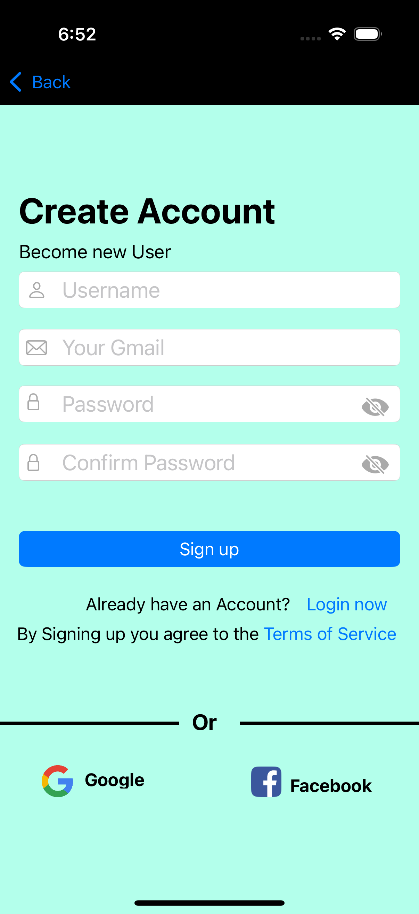

# iOS Application - User Interface

## Overview
This iOS application provides a seamless user interface for user authentication. The app is designed to ensure a smooth user experience, featuring a welcome screen, login, signup, and password recovery functionalities. Built using **Xcode**, this app showcases my skills in iOS development and UI design.

## Features

### 1. Launch Screen
- The first page users see when they open the app.
- Displays a welcoming message to create a positive first impression.

### 2. Login Page
- Asks users to input their **username** and **password**.
- Provides options for:
  - **"Forgot Password"** button: Redirects users to the password recovery page.
  - **"Sign Up"** button: Navigates users to the signup page.
  - **Login with Google and Facebook**: Social media login integration for a quicker login experience.

### 3. Signup Page
- Collects user details to create a new account.
- Includes:
  - **Back to Login** button for easy navigation back to the login page.
  - **Google and Facebook** buttons to create an account via social media.

### 4. Forgot Password Page
- Prompts the user to enter their **email address** or **phone number** to reset their password.
- Includes:
  - **"Create Account"** button: Takes the user to the signup page.
  - **"Login"** button: Navigates back to the login page.

## Technical Details
- **Framework Used**: Xcode
- **Programming Language**: Swift
- **Platform**: iOS

## How to Run the Project
1. Open the project in **Xcode**.
2. Ensure that you have the required **iOS Simulator** or a physical device for testing.
3. Run the project by clicking on the **Run button** or pressing Cmd + R.

## Screenshots

## Future Enhancements
- Integration of backend services for handling authentication.
- Adding more social media login options.
- Improved UI/UX for better accessibility and user experience.
